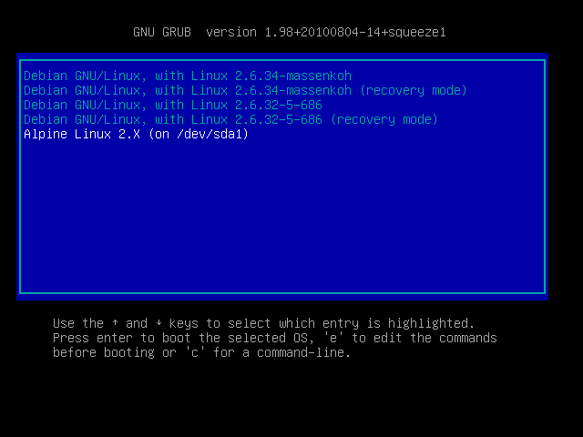
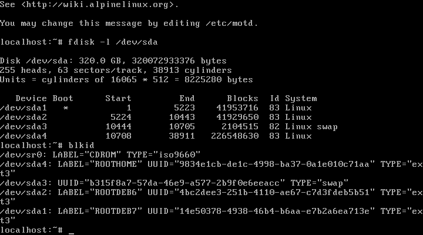
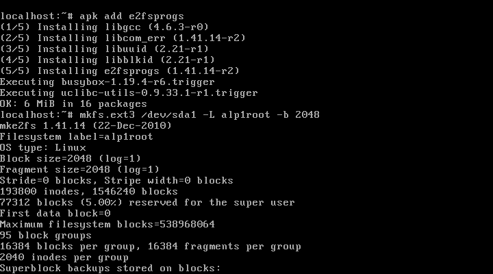
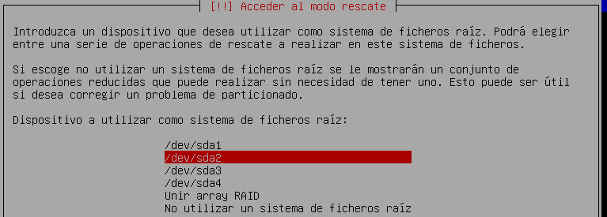
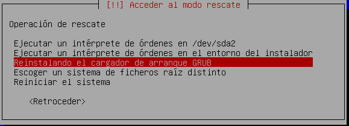
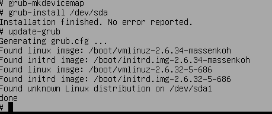

Este documento guiara para instalar Alpine optimizado y usando dual boot, pero 
el gestor de arranque sera comandado desde el otro sistema que asumiremos Linux y con Grub.
Debe descargar un ISO de Alpine version "extended" recomendable para internet lento.

Si no posee un USBdrive puede grabar el archivo ISO en un CD o DVD, si no posee ninguno 
lease: [instalar-desde-virtualbox-a-discoreal-dualboot-guia.md](instalar-desde-virtualbox-a-discoreal-dualboot-guia.md)



## preparar medios para instalar

Alpine desde la version 3.4 es "isohybrid" lo que significa que puede hacer facil un USB arrancable 
simplemente copiando su contenido en el dispositivo entero, para ello debe identificar el 
dispositivo usando `blkid` y despues asumiendo el USB es "sde" se realiza el comando:

```
cp alpine-extended-3.8.2-x86.iso /dev/sde
```

**IMPORTANTE** aqui se identifico el disco USB como `/dev/sde` esto se identifica con `blkid` .

Despues hacemos que arranque la maquina el disco USB en vez del disco duro, y arrancara el linux.
Al iniciar Alpine preguntara pro el login, solo escribir `root` y pulsar enter permite iniciar:


## Configurar disco en donde instalar

A diferencia de otros sistemas de instalacion, el de alpine es automatico en el disco, 
y monta un viaje de particiones innecesarias, para hacer una configuracion manual 
hay que ejecutar `fdisk` y `blkid` para identificar, y despues montarlo para `setup-disk` y alli indicar.

#### 1. Particion a utilizar

Aqui no se podra usar la estupidez de particionamiento complicado, porque ya hay otras particiones 
usadas recordemos que usaremos "dual boot" o arranque dual con otro(s) sistema(s) instalados.
La separacion era solo porque a medida se instalaba o necesitaba espacio no se 
podia apagar la maquina y de paso los discos eran lentos y pequeños... 
por ello existia las particiones y el LVM, cosa que hoy es innecesria en desktop..

**IMPORTANTE** colocar LVM hace mas lento, se aprecia cuando trabajas con java y eclipse 
y las maquinas sin LVM son EVIDENTEMENTE mas rapidas. Otra forma de evidenciarlo 
es usando un disco SSD, porque son mas rapidos, obvio el acceso es mas rapido.. 
pienselo, LVM es una capa mas sobre las ya capas de manejo de sistema de ficheros...

**NOTA1: swap** si nohay swap crear una no mas de 2G es ilogico.. leer documentacion redhat y diseño del kernel.
**NOTA2: LVM** en las laptops es mas que innecesario una swap grande o LVM ya que las pone mas lentas.

**identificar las particones existentes**: se realiza con `fdisk` asi:

```
fdisk -l /dev/sda
Disk /dev/sdb: 298,1 GiB, 320072933376 bytes, 625142448 sectors
Identifier: 0x0009b7e5

/dev/sda1  *           63  83907494  83907432    40G 83 Linux
/dev/sda2        83907495 167766794  83859300    40G 83 Linux
/dev/sda3       167766795 171975824   4209030     2G 82 Linux swap / Solaris
/dev/sda4       172007955 625105214 453097260 216,1G 83 Linux
```

Aqui tenemos dos particiones iguales sabemos ahora el numero (sda1 o sda2), 
ahora para saber mas detallado cual usamos otra tecnica

**identificar que particion de las existentes**: se realiza con `blkid` asi:

```
blkid
/dev/sda1: LABEL="ROOTDEB7" UUID="14e50378-4938-46b4-b6aa-e7b2a6ea713e" SEC_TYPE="ext2" TYPE="ext3" PARTUUID="0009b7e5-01"
/dev/sda2: LABEL="ROOTDEB6" UUID="4bc2dee3-251b-4110-ae67-c7d3fdeb5b51" SEC_TYPE="ext2" TYPE="ext3" PARTUUID="0009b7e5-02"
/dev/sda3: UUID="b315f8a7-57da-46e9-a577-2b9f0e6eeacc" TYPE="swap" PARTUUID="0009b7e5-03"
/dev/sda4: LABEL="ROOTHOME" UUID="9834e1cb-de1c-4998-ba37-0a1e010c71aa" TYPE="ext4" PARTUUID="0009b7e5-04"
```

Aqui usaremos la particion "sda1" porque la "sda2" esta el sistema que no queremos se altere, y 
que de paso segun este documento sera el usado para comandar y gestionar el arranque con grub.




#### 2. Configurar disco

Una vez particionado debemos preconfigurar el `setup-disk` con el 
destino que se usara. Para esto formateamos, montamos y ejecutamos indicacion:

```
apk add e2fsprogs
mkfs.ext3 /dev/sda1 -L alp1root -b 2048
mount -t ext3 /dev/sda1 /mnt
```

Esto dejara el disco alli pendiente, el instalador le indicaremos no usarlo para despues, reconfigurar que se usara.

**IMPORTANTE** ya que usaremos archivos pequenos mas que grandes, la raiz usara "2048" 
en vez de "4096" permitiendo mas fragmentacion y asi encontrando mas rapido la escritura. 
En el caso de la particion home esta si dejarla con 4096 ya que alli ud guardara su ~porn~ digo peliculas, 
Esto es porque alocar un bloque grande para un archivo pequeño hace que las busquedas sean lentas, 
el sistema operativo tiene muchos archivos pequeños asi que por eso usar un tamaño de bloque pequeño.



# Instalacion

Hay dos maneras de usar arranque dual, una es que Alpine gestione el arranque y la otra es 
que otro linux gestione el arranque, en este documento se asume existe otro linux, 
si quere que alpine gestione el arranque lease [instalar-desde-virtualbox-a-discoreal-dualboot-guia-grub.md](instalar-desde-virtualbox-a-discoreal-dualboot-guia-grub.md)

Alpine usa una version cortada de Libc llamda `musl` desde la 3.X, en 
las versiones viejas usaba `uClibc` ambas siempre ponen el teclado a ingles, 
asi que cuidado con lo que escribe esto no es winbuntu, esto es linux okey:

**ADVERTENCIAS** la cagada como todas las minimalistas es que se requiere internet, 
a menos tengas una imagen ya instalada y simplemente la clones en el disco. 
asi que **necesitas insternet si es primera vez o no tienes imagen alpine**.

## Instalar el sistema base

**IMPORTANTE** debes cuando llegue a la parte del disco "Which disks yous you like to use?" 
contestar "none",de alli en adelante contestar "none" hasta salir, esto para permitir 
la configuracion customizada de disco.


```
setup-alpine
```

No usar ningun flag, solo el comando, despues de contestar "none" a las preguntas sobre el 
disco, ejecutar el configurador del disco para colocar lso archivos en el disco:

```
setup-disk -m sys /mnt
```

Esto copiara el sistema al disco pero recordemos tenemos el sistema en una sola particion 
y que tenemos otro linux en "/dev/sda2" en la segunda particion, asi que el siguiente apartado 
es arrancar este linux en modo chroot y desde el mismo instalar/actualizar su manager de arranque.


## Actualizar el arranque desde particion Linux otra

(WIP) necesita chroot en el modo install y actualmente da problemas...

## Actualizar el arranque desde particion Debian

Recordemos que sera arranque dual pero que no sera administrado por Alpine, imaginemos tenemos Debian en la segunda particion:

* Arrancamos con el cd de instalacion misma version a la instalado y misma arquitectura (ejemplo debian 6 con arm64)
* Al iniciar se debe escoger "avanzado" y en este menu esta la opcion "Rescue mode" que se escogera
* Se contestan las preguntas de idioma, teclado, hostname, etc hasta que pregunte por el sistema raiz
* Cuando pregunte por el sistema de ficheros raiz, escoger la particion sda2 puesto alli tenemos el debian en nuestro caso.
* Despues ofrece un menu, se escoge "Reinstalar el cargador de arranque Grub", este preguntara el dispositivo que es "/dev/sda"
* con estos sencillisimos pasos ya el sistema de "sda2" Debian es el que maneja el arranque y Alpine no.
* Despues de esto debemos arrancar el sistema Debian y alterar el grub para que coloque bien el Alpine
* Ejecutar en uan consola en el Debian `blkid /dev/sda1` para saber el UUID de la particion Alpine.
* Despues crear o editar el archivo `/etc/grub.d/40_custom` para agregar la entrada Alpine esta se detalla mas abajo.
* Al final ejecutar `update-grub` y reinicar y probar.

La entrada Alpine en `/etc/grub.d/40_custom` debe ser asu (el UUID se toma con blkid a sda1):

```
menuentry "Alpine Linux (on /dev/sda1)" {
    insmod part_msdos
    insmod ext2
    set root='(hd0,msdos1)'
    search --no-floppy --fs-uuid --set fd6dd397-42c4-4474-9096-e5a5dff0a861
    linux /boot/vmlinuz-3.4.82-grsec root=UUID=fd6dd397-42c4-4474-9096-e5a5dff0a861  modules=sd-mod,usb-storage,ext3 ro
    initrd /boot/initramfs-3.4.82-grsec
}
```








# Vease tambien:

* [README informacion general](../README.md)
* [instalar-desde-usb-cdrom-alpinesolo-guia-optimizado.md](instalar-desde-usb-cdrom-alpinesolo-guia-optimizado.md)
* [instalar-desde-virtualbox-a-discoreal-alpinesolo-guia.md](instalar-desde-virtualbox-a-discoreal-alpinesolo-guia.md)
* [instalar-desde-virtualbox-a-discoreal-dualboot-guia.md](instalar-desde-virtualbox-a-discoreal-dualboot-guia.md)
* [Informes y tablas de compatibilidad](../informes/hardware-y-versiones-alpine-recomendados.md)
